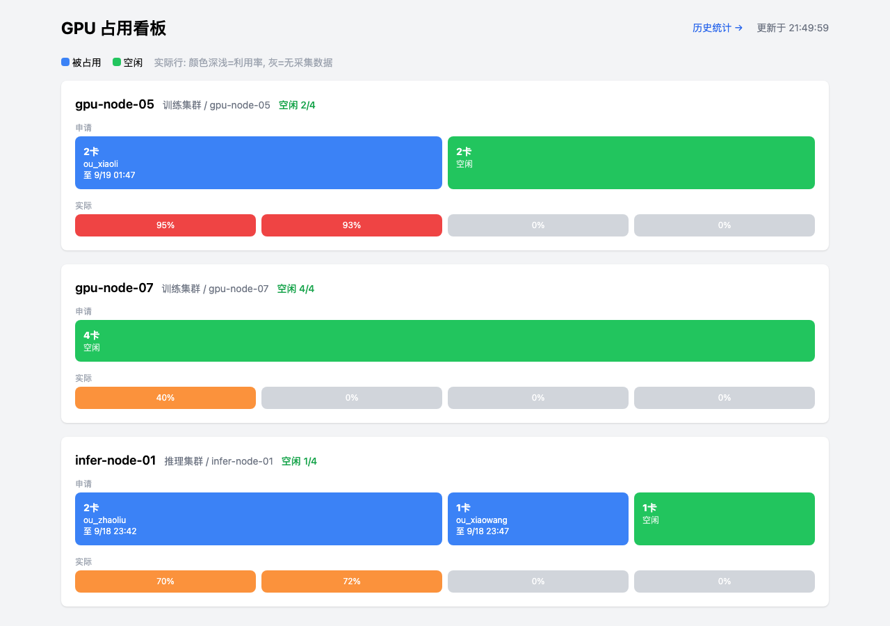
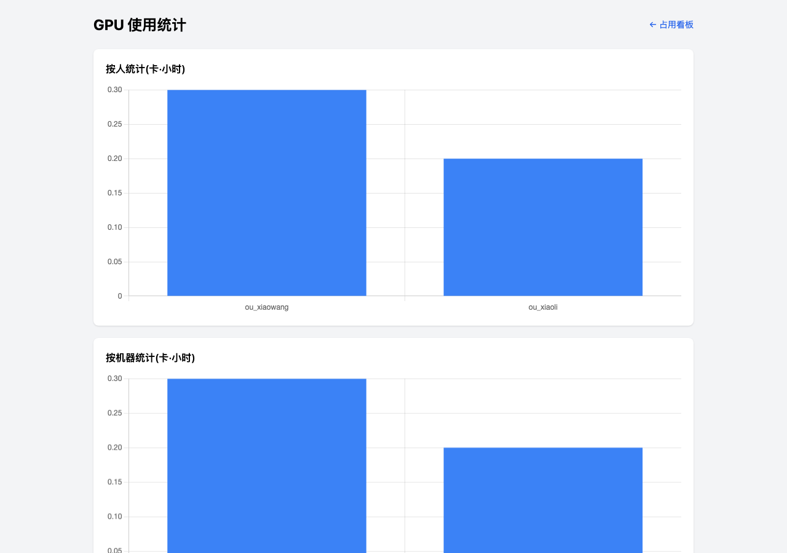

# GPU Booking

团队 GPU 占用管理:飞书群里一句话申请 GPU,到期自动提醒/释放,网页看板实时展示占用。

**语义是"申请-占用-释放",不是提前预约**:申请成功即占用,别人申请同节点会被拒绝;释放或到期后别人才能申请。只按数量,不绑定物理卡号(卡由 K8s 调度)。



## 飞书用法

群里 @机器人:

```
集群一 4卡 4h            自动选空闲最多的节点
集群一 节点5 4卡 4h      指定节点(尾号匹配 gpu-node-05)
集群一 节点5~10 4卡 4h   节点范围
状态                     各节点空闲情况
我的                     我的占用
```

私信机器人:

```
续 2h                    续订(多条占用时: 续 gpu-node-05 2h)
释放                     提前释放(多条占用时: 释放 gpu-node-05)
```

到期前 10 分钟私信提醒续订;不续自动释放并计入历史统计。



## 架构

```
飞书群/私信 ──事件回调──> FastAPI /feishu/events
                              ├─ 消息解析 → 申请/续订/释放 → SQLite
                              ├─ APScheduler: 到期提醒+自动释放(1min)
                              └─ APScheduler: GPU 实际状态采集(60s)
                                     ├─ custom_http 适配器(已有 API)
                                     ├─ prometheus 适配器(DCGM 指标)
                                     └─ k8s_api 适配器(Pod 请求数)
网页: / 占用看板   /stats 历史统计   /api/status /api/stats
```

技术栈: FastAPI + SQLModel + SQLite + APScheduler + httpx(飞书 API) + Tailwind/Alpine.js/Chart.js(CDN)。

采集失败只记日志,不影响申请。拿不到卡号的集群按"节点级占用"显示。

## 部署

```bash
docker build -t gpu-booking .
docker run -d -p 8000:8000 \
  -e FEISHU_APP_ID=cli_xxx \
  -e FEISHU_APP_SECRET=xxx \
  -e FEISHU_VERIFY_TOKEN=xxx \
  -e TZ=Asia/Shanghai \
  -v gpu-data:/data \
  gpu-booking
```

或本地: `pip install -r requirements.txt && uvicorn app.main:app`

飞书后台:事件订阅填 `https://<域名>/feishu/events`,订阅 `im.message.receive_v1`,权限 `im:message`、`contact:user.base`,群里 @机器人 生效。

## 初始化数据

```bash
# 登记集群(adapter_type: custom_http / prometheus / k8s_api)
curl -X POST localhost:8000/api/clusters -H 'Content-Type: application/json' -d '{
  "name": "训练集群",
  "adapter_type": "custom_http",
  "endpoint": "http://你们的GPU状态API",
  "extra_config": "{\"items_path\":\"data.gpus\",\"map\":{\"node_name\":\"node\",\"gpu_index\":\"idx\",\"allocated\":\"used\",\"util\":\"util\",\"mem_used\":\"mem_used\",\"mem_total\":\"mem_total\"}}"
}'

# 登记节点
curl -X POST localhost:8000/api/machines -H 'Content-Type: application/json' -d '{
  "name": "gpu-node-05", "cluster_name": "训练集群", "node_name": "gpu-node-05", "total_gpus": 8
}'
```

## 项目结构

```
app/
  main.py        FastAPI 入口, 飞书回调
  handler.py     消息命令分发
  parser.py      消息解析(申请/续/释放/状态/我的)
  db.py          申请、冲突检查、续订、释放、到期
  models.py      clusters / machines / reservations / usage_logs / gpu_actual
  feishu.py      飞书 token、收发消息、事件解析
  scheduler.py   定时: 到期提醒+释放、实际状态采集
  api.py         /api/status /api/stats + 集群/机器登记
  adapters/      custom_http / prometheus / k8s_api 采集适配器
  templates/     看板 + 统计页
```
