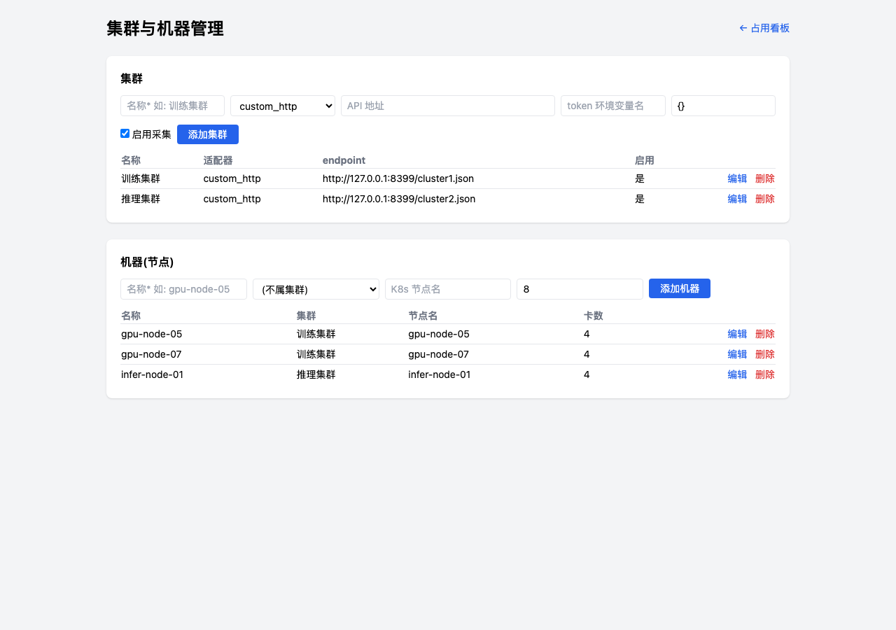

# GPU Booking

团队 GPU 占用管理:飞书群里一句话申请 GPU,到期自动提醒/释放,网页看板实时展示占用。

**语义是"申请-占用-释放",不是提前预约**:申请成功即占用,别人申请同节点会被拒绝;释放或到期后别人才能申请。只按数量,不绑定物理卡号(卡由 K8s 调度)。


## 飞书用法

群里 @机器人:

```
集群一 4卡 4h            自动选空闲最多的节点
集群一 节点5 4卡 4h      指定节点(尾号匹配 gpu-node-05)
集群一 节点5~10 4卡 4h   节点范围
状态                     各节点空闲情况
我的                     我的占用
```

私信机器人:

```
续 2h                    续订
释放                     提前释放
```

多条占用时的规则:

- 只有一条 → `续 2h` / `释放` 直接生效
- 多条且在不同节点 → 列出清单,指定节点再操作: `释放 node1`
- 多条且在同一节点 → 直接操作**最早到期**的那条,并提示剩余条数
- 不同集群有同名节点 → 集群名一起指定: `释放 集群一 node1`(也支持 `集群一/node1`)

到期前 10 分钟私信提醒续订;不续自动释放并计入历史统计。


## 架构

```
飞书群/私信 ──WebSocket 长连接──> feishu_ws(默认, 纯内网可用)
         ──HTTP 回调─────────> FastAPI /feishu/events(备选)
                              ├─ 消息解析 → 申请/续订/释放 → SQLite
                              ├─ APScheduler: 到期提醒+自动释放(1min)
                              └─ APScheduler: GPU 实际状态采集(60s)
                                     ├─ custom_http 适配器(已有 API)
                                     ├─ prometheus 适配器(DCGM 指标)
                                     └─ k8s_api 适配器(Pod 请求数)
网页: / 占用看板   /stats 历史统计   /admin 集群机器管理   /api/status /api/stats
```

技术栈: FastAPI + SQLModel + SQLite + APScheduler + lark-oapi/httpx(飞书) + Tailwind/Alpine.js/Chart.js(CDN)。

采集失败只记日志,不影响申请。拿不到卡号的集群按"节点级占用"显示。所有时间使用容器本地时区(建议 `TZ=Asia/Shanghai`)。

## 部署

```bash
git clone https://github.com/panpan0000/gpu-booking.git && cd gpu-booking
cp .env.example .env   # 填 FEISHU_APP_ID / FEISHU_APP_SECRET
docker compose up -d --build
```

或纯 docker:

```bash
docker build -t gpu-booking .
docker run -d -p 8000:8000 \
  -e FEISHU_APP_ID=cli_xxx \
  -e FEISHU_APP_SECRET=xxx \
  -e TZ=Asia/Shanghai \
  -v gpu-data:/data \
  gpu-booking
```

或本地: `pip install -r requirements.txt && FEISHU_APP_ID=... FEISHU_APP_SECRET=... uvicorn app.main:app`

### 飞书后台配置

1. **权限**: `im:message`、`im:message:send_as_bot`、`contact:user.base`
2. **事件与回调** → 订阅方式选 **「使用长连接接收事件」**(默认模式,无需公网地址) → 添加事件 **`im.message.receive_v1`(接收消息)**
3. 应用功能里启用**机器人**,把机器人拉进群
4. **发布版本**(改权限/事件后必须发版)

已有公网地址时也可选 HTTP 回调模式: 订阅方式选「将事件发送至开发者服务器」,请求地址填 `https://<域名>/feishu/events`,并把 Verification Token 填进 `FEISHU_VERIFY_TOKEN`,启动时设 `FEISHU_TRANSPORT=http`。

## 初始化数据

打开 `/admin` 网页直接增删改查集群和机器(有进行中占用的机器禁止删除):



也可以用 API(`POST/PUT/DELETE /api/clusters`、`POST/PUT/DELETE /api/machines`):

```bash
# 登记集群(adapter_type: custom_http / prometheus / k8s_api)
curl -X POST localhost:8000/api/clusters -H 'Content-Type: application/json' -d '{
  "name": "训练集群",
  "adapter_type": "custom_http",
  "endpoint": "http://你们的GPU状态API",
  "extra_config": "{\"items_path\":\"data.gpus\",\"map\":{\"node_name\":\"node\",\"gpu_index\":\"idx\",\"allocated\":\"used\",\"util\":\"util\",\"mem_used\":\"mem_used\",\"mem_total\":\"mem_total\"}}"
}'

# 登记节点
curl -X POST localhost:8000/api/machines -H 'Content-Type: application/json' -d '{
  "name": "gpu-node-05", "cluster_name": "训练集群", "node_name": "gpu-node-05", "total_gpus": 8
}'
```

## 注意事项

- **机器业务名全局唯一**: 不同集群的同名节点,登记时 `name` 要区分开(如 `A-node1` / `B-node1`),`node_name` 保持和 K8s 一致即可
- 采集按 `集群名 + node_name` 关联,所以 cluster 改名后历史 gpu_actual 数据对不上,改名前注意
- SQLite 单文件,适合中小团队;多实例部署请换外部数据库(`DB_URL`)

## 项目结构

```
app/
  main.py        FastAPI 入口, 飞书 HTTP 回调
  feishu_ws.py   飞书 WebSocket 长连接(默认收消息方式)
  handler.py     消息命令分发
  parser.py      消息解析(申请/续/释放/状态/我的)
  db.py          申请、冲突检查、续订、释放、到期
  models.py      clusters / machines / reservations / usage_logs / gpu_actual
  feishu.py      飞书 token、收发消息、事件解析
  scheduler.py   定时: 到期提醒+释放、实际状态采集
  api.py         /api/status /api/stats + 集群/机器 CRUD
  adapters/      custom_http / prometheus / k8s_api 采集适配器
  templates/     看板 + 统计页 + 管理页
```
